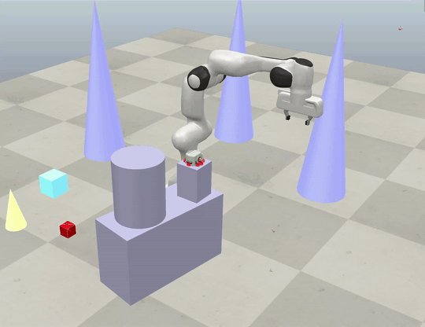
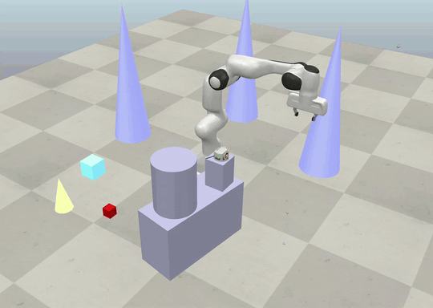
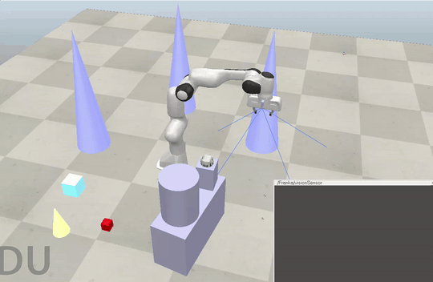
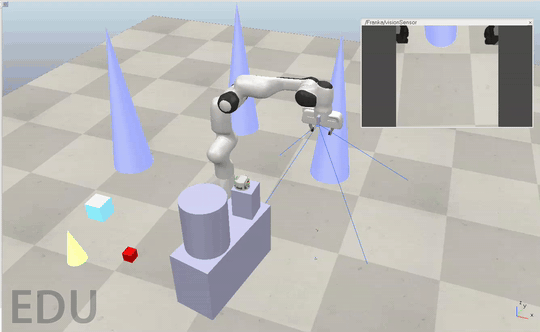

# Task and Motion Planning for Robotic Manipulation

A Franka Panda arm that, given a high-level goal like *"move the red cube to the bin"*, works out the steps on its own, plans collision-free motions, executes them, checks whether they worked, and replans when something changes. Everything runs in the [CoppeliaSim](https://www.coppeliarobotics.com/) physics simulator and is driven from Python.

The goal was to put the classic *sense → plan → act* loop on a real 7-DoF arm: symbolic planning on top, motion planning underneath, and a closed loop around both so the robot adapts instead of running a fixed script.

<p align="center">
  <br>
  <em>The arm grasps the cube, I move it mid-task, and it notices, aborts, and replans to the new position.</em>
</p>

---

## What it does

- **Plans the task by itself.** You give it a goal state, not a script. A STRIPS-style planner searches for the sequence of `move → pick → place` actions that reaches the goal.
- **Plans collision-free motion.** Each action becomes a joint-space path around the obstacles in the scene, solved with sampling-based motion planning and inverse kinematics.
- **Closes the loop.** After every action it verifies the outcome, and if the target moves while the arm is in transit it drops the plan and replans from the current state.
- **Sees the scene.** A wrist camera lets the arm locate an object by shape and colour and pick it up, instead of being handed coordinates.

---

## Demos

**Pick and place around obstacles**

<p align="center">
  <br>
  <em>A full pick-and-place cycle. The arm plans a path that avoids the cones, cylinder and boxes.</em>
</p>

**Scanning the environment**

<p align="center">
  <br>
  <em>The wrist-camera sweep: the arm orbits a set of azimuth and tilt poses to look around the table.</em>
</p>

**Vision-driven pick**

<p align="center">
  <br>
  <em>You ask for an object by shape and colour. The arm sweeps, detects it in the camera feed, back-projects the detection to a 3D world position, then picks it up.</em>
</p>

Full-resolution clips are in [`media/videos/`](media/videos).

---

## How it works

```
                      GOAL:  red cube -> bin
                                │
        ┌──── sense ───────────▼───────────────────────┐
        │  read the world (wrist camera, or sim state)  │
        └───────────────────────┬───────────────────────┘
                                 │
        ┌──── plan ──────────────▼───────────────────────┐
        │  STRIPS state + BFS  ->  action sequence        │
        │  move_to · pick · place                         │
        └───────────────────────┬───────────────────────┘
                                 │
        ┌──── execute ───────────▼───────────────────────┐
        │  IK goal config  ->  OMPL collision-free path   │
        │  ->  gripper open / close / attach              │
        └───────────────────────┬───────────────────────┘
                                 │
        ┌──── verify ────────────▼───────────────────────┐
        │  pick / place succeeded?                        │
        │  did the target move mid-motion?                │
        └───────┬────────────────────────────┬───────────┘
                │ ok                          │ changed
            goal reached                   replan  ↺
```

**Task planner (`src/task_planner.py`).** The symbolic layer. World state is a frozen, hashable dataclass (object locations, what the gripper holds, where the arm is), so states drop straight into a `visited` set for search. Three actions (`move_to`, `pick`, `place`) encode their preconditions and effects, and `plan()` runs breadth-first forward search for the shortest action sequence that reaches the goal.

**Motion planner (`src/motion_planner.py`).** The geometric layer. For a target pose it solves IK once for a goal joint configuration, then uses CoppeliaSim's OMPL plugin to find a collision-free joint-space path from the current configuration to the goal, executed with a smooth velocity profile. The grasp logic toggles the cube's collidable flag at the right moments so the planner can reach the cube to pick it, then accounts for the cube's volume while carrying it.

**Closed-loop controller (`src/main.py`).** Ties it together: sense the world, plan, execute each action, verify. A `safety_check` runs at every motion waypoint, so if the target drifts from where the plan assumed it was, the motion stops cleanly and the controller replans.

**Perception and vision pick (`src/perception.py`, `src/vision_pick.py`).** The arm carries a wrist camera. `perception.py` drives the search sweep and holds the camera maths: pinhole intrinsics, projecting 3D points to pixels, and back-projecting a pixel to a world coordinate against the known table plane. `vision_pick.py` uses colour segmentation (OpenCV) to detect a requested object live in the camera feed, back-projects it to a world position, and runs the pick-and-place.

---

## Repository layout

```
src/
  main.py            Closed-loop controller (sense → plan → execute → verify → replan)
  task_planner.py    STRIPS state + BFS task planner
  motion_planner.py  OMPL motion planning, IK, gripper, grasp logic
  perception.py      Wrist-camera sweep + pinhole projection / back-projection
  vision_pick.py     Vision-driven pick-and-place (colour segmentation)
  environment.py     Helper to read joint / end-effector state
  test_sweep.py      Standalone perception-sweep test
  experiments/       Early building blocks (first hardcoded pick, gripper test, IK test)
media/               Demo GIFs, scene render, full-resolution videos
```

---

## Running it

You need [CoppeliaSim EDU](https://www.coppeliarobotics.com/) (v4.x) with a scene containing a Franka Panda arm, a cube, a destination dummy, and the obstacles. The scripts talk to the simulator over the ZeroMQ remote API, so CoppeliaSim has to be open with the simulation running.

```bash
python -m venv venv && source venv/bin/activate
pip install -r requirements.txt
```

Then, with CoppeliaSim running:

```bash
cd src
python main.py          # closed-loop task-and-motion planning
python vision_pick.py   # vision-driven pick using the wrist camera
```

---

## Stack

Python · CoppeliaSim (ZeroMQ remote API) · OMPL (sampling-based motion planning) · CoppeliaSim IK · OpenCV · NumPy

## License

MIT, see [LICENSE](LICENSE).

## Course

Built for CSCI 6650 (Intelligent Agents) at the University of New Orleans.
